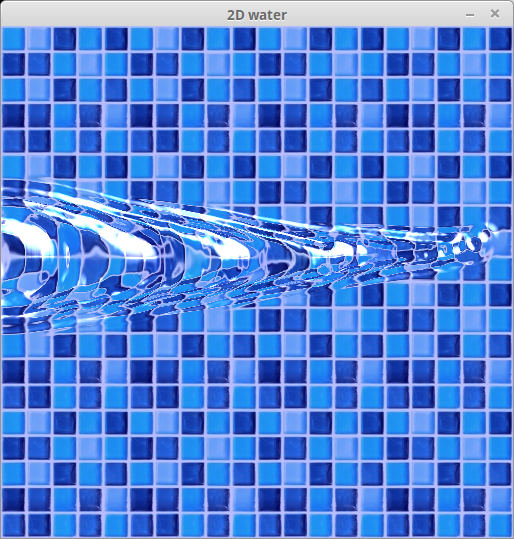

# 2D-water-gpu
Interactive 2D water simulation running on GPU, using C++, SFML, OpenGL shaders.

# Usage
You can interact with the water with left mouse button.
Press R to reset the simulation.

As the simulation runs at 60 fps, sometimes the time frame between two simulation steps isn't small enough, resulting in instabilities.

# Algorithm
The water surface is stored as a heightmap in a sf::Texture (FBO).
It is subdivided in a grid, each node corresponding to a pixel in the buffer.

A node holds two informations:
* position: stored in red and green channels
* velocity: stored in blue and alpha channels

Each node is influenced by three forces:
* "vertical spring": each node tends to come back to the mid-height level
* surface tension: a node tends to be aligned with its four immediate neighbours
* friction: constant multiplicative factor, lesser than 1, applied to velocity

# COMPILATION
This project expects SFML 2.3.2 to be installed on the machine.
It also requires at least OpenGL 3.0 with support for shaders.

